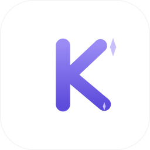
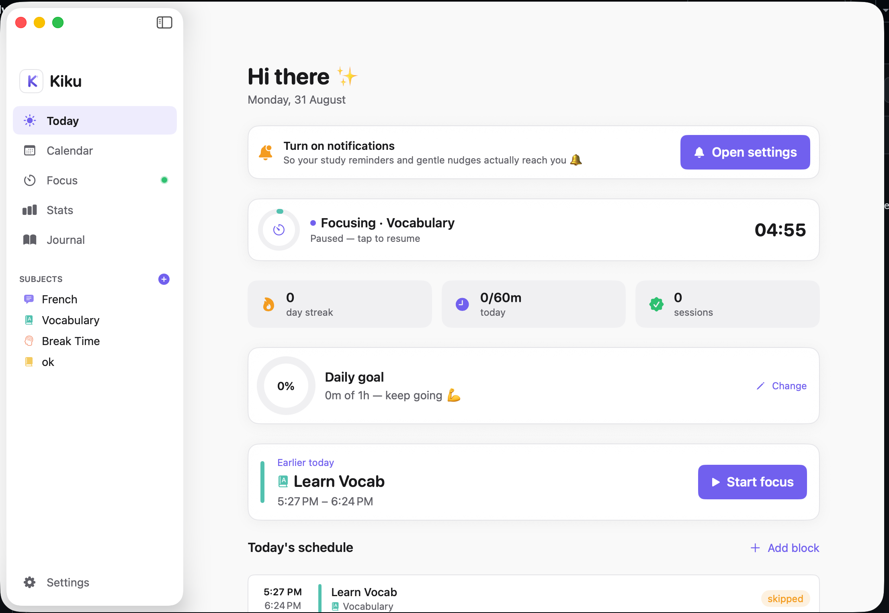
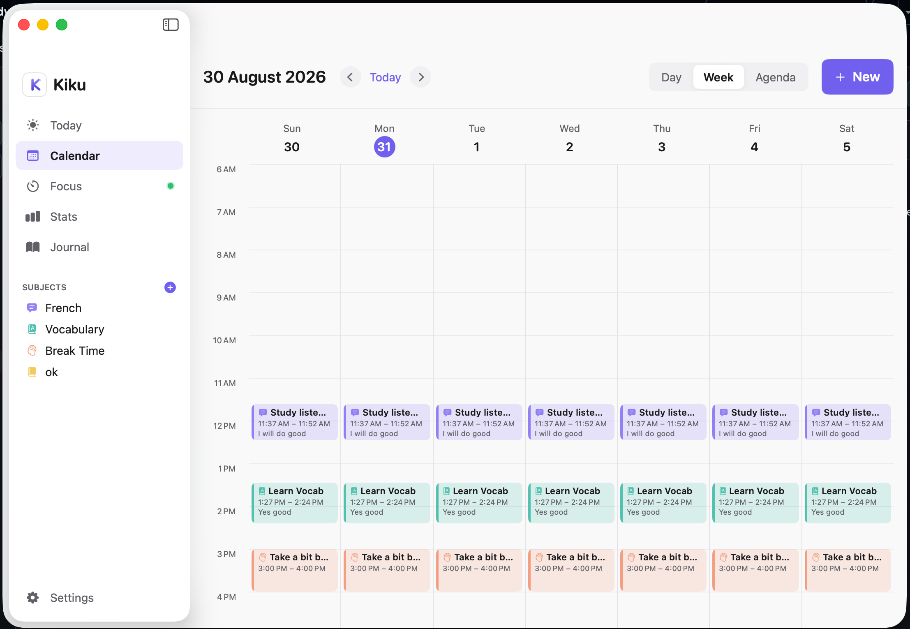
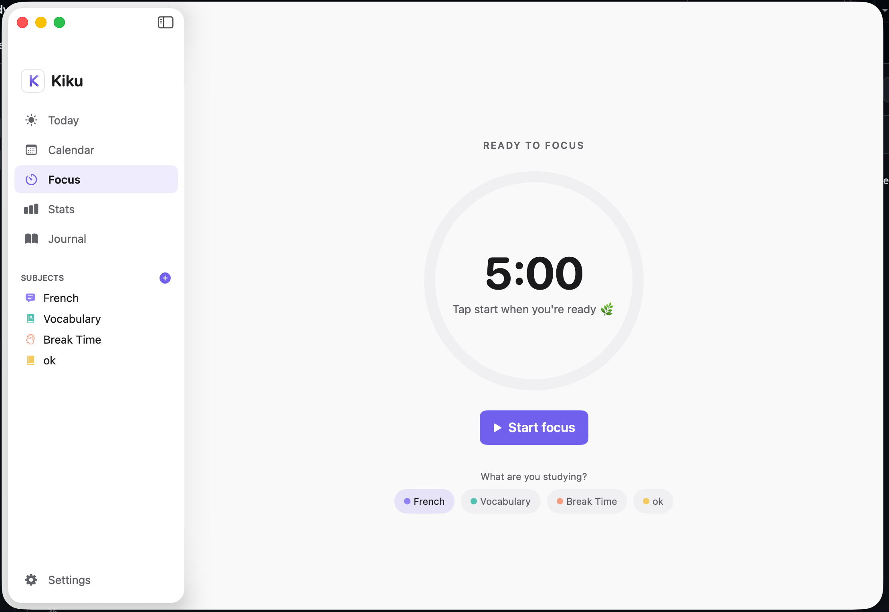
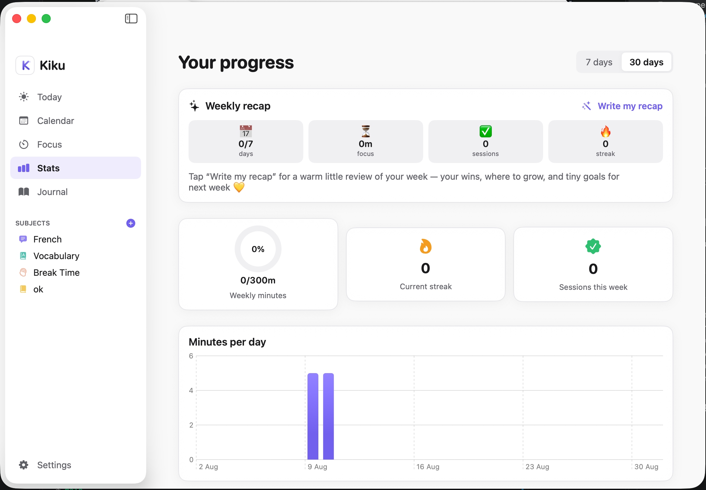
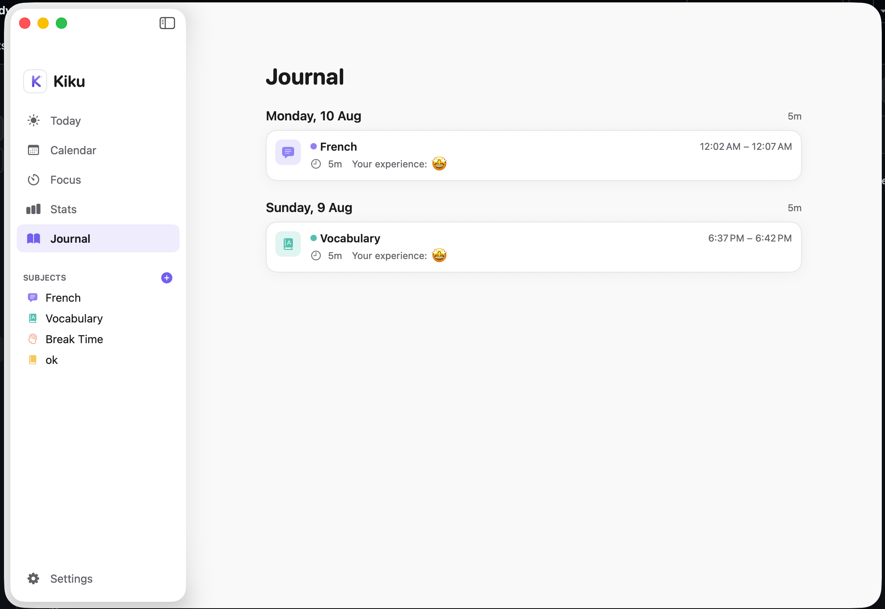
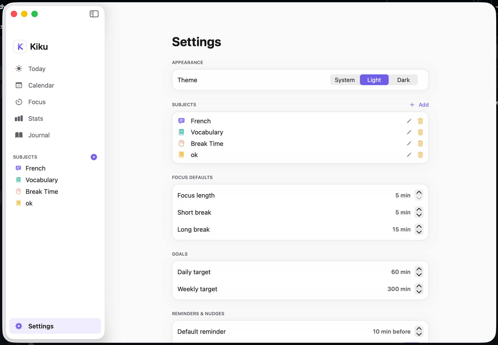

<div align="center">



# 🎐 Kiku

**A calm, cute-but-professional study companion for macOS.**

Plan your week, focus with a Pomodoro timer, stay gently accountable, and reflect with a warm weekly recap — all in a clean, Notion-inspired interface.

<br/>


</div>

---

## 📸 Screenshots


| Today | Calendar | Focus |
| --- | --- | --- |
|  |  |  |

| Stats | Journal | Settings |
| --- | --- | --- |
|  |  |  |

---

## ✨ Features

- 🏠 **Today dashboard** — a friendly greeting, daily-goal ring, next study block, live focus status, and streak / minutes / session stats.
- 🗓️ **Calendar** — Day / Week / Agenda views with recurring study blocks, drag-to-move, and hover-to-add.
- ⏳ **Focus (Pomodoro)** — focus sessions with automatic short/long breaks, a live menu-bar countdown, and end-of-session logging.
- 🔔 **Gentle accountability** — reminders, start nudges, "still focusing?" presence check-ins (in-app modal **and** system notification), and kind skip nudges.
- 📖 **Journal** — an editable diary of every study session, with subject, time, note, and how it felt.
- 📊 **Stats** — Swift Charts for minutes/day, per-subject breakdown, streaks, and weekly goals.
- 🪄 **Weekly AI recap** *(optional)* — a reflective, motivating summary powered by the Gemini API.
- 📱 **Google Calendar sync** — mirrors blocks to macOS Calendar via EventKit, so they reach your phone.
- 🎉 **Delightful details** — a custom logo, light/dark themes, cute micro-interactions, a menu-bar timer, first-run onboarding, and a heart-warming goal-completion celebration.
- 💾 **Resilient** — the timer state survives quitting the app and resumes correctly, and everything works fully offline (except sync + AI recap).

---

## 🧰 Tech stack

- **SwiftUI** + **SwiftData** (macOS 14+)
- **Swift Charts** for stats
- **UserNotifications** for reminders & nudges
- **EventKit** for calendar sync
- **Gemini API** for the optional weekly recap
- **XcodeGen** for a reproducible project from `project.yml`

---

## 🛠 Requirements

- macOS **14.0+**
- **Xcode 15+**
- **[XcodeGen](https://github.com/yonyz/XcodeGen)** — `brew install xcodegen`

---

## 🚀 Build & run (from source)

```bash
# 1. Generate the Xcode project from project.yml
xcodegen generate

# 2. Open it and press ⌘R
open Kiku.xcodeproj
```

> The generated `Kiku.xcodeproj` is intentionally **not** committed — `xcodegen generate` recreates it any time.

---

## 📦 Build a distributable `.dmg`

```bash
# Without AI recap (everything else works):
./scripts/build_dmg.sh

# With the weekly AI recap — pass your Gemini key via env (never hardcoded):
GEMINI_API_KEY=your_key_here ./scripts/build_dmg.sh
```

The finished installer is written to **`dist/Kiku.dmg`**.

> 🔑 The API key is injected at build time from the `GEMINI_API_KEY` environment variable into the app's `Info.plist`. It is **never stored in the source**. Without a key, the app runs perfectly — only the weekly recap is disabled.

---

## 💿 Install & use the `.dmg`

1. **Open** `Kiku.dmg` and **drag Kiku into the Applications folder**.
2. Because the app is signed locally (not notarized by Apple), macOS Gatekeeper will block it the first time on another Mac. Clear the "downloaded from the internet" flag **once**:
   ```bash
   xattr -dr com.apple.quarantine /Applications/Kiku.app
   ```
   *(Alternatively: right-click the app → **Open** → **Open**, or **System Settings → Privacy & Security → Open Anyway**.)*
3. Launch Kiku. On first run it will **guide you through notifications and calendar permissions**.

> Why this step? Apps you build yourself are trusted locally, but once a `.dmg` is transferred to another Mac it gets quarantined. The command above simply removes that flag. For a zero-warning, double-click experience everywhere, sign & **notarize** with an Apple Developer account.

---

## 🔑 Optional: enable the weekly AI recap

The recap uses the **Gemini API**. Two ways to provide a key (kept out of git):

**A) Environment (recommended for `.dmg`)**
```bash
GEMINI_API_KEY=your_key_here ./scripts/build_dmg.sh
```

**B) Local file (for Xcode GUI builds)**
```bash
cp Config/Secrets.example.xcconfig Config/Secrets.local.xcconfig
# then edit it:  GEMINI_API_KEY = your_key_here
```

Get a free key at <https://aistudio.google.com/app/apikey>. `Config/Secrets.local.xcconfig` is gitignored — **never commit your key**.

---

## 📅 Google Calendar sync (reaches your phone)

1. **System Settings → Internet Accounts → add Google**, and enable **Calendars**.
2. In Kiku: **Settings → Calendar sync → toggle on**, then **Allow** when macOS asks.
3. Pick your Google calendar in the dropdown.

Study blocks you create / edit / move now appear on your phone with reminders.

---

## 🔔 Notifications not showing?

Grant permission during onboarding or in **Settings**. If nothing appears:
- **System Settings → Notifications → Kiku** → allow, style **Banners** or **Alerts**, sounds on.
- Turn off **Focus / Do Not Disturb**.
- Use **Settings → Send test** inside Kiku to verify delivery.

---

## 🧱 Project structure

```
Kiku/
├── project.yml            # XcodeGen project spec
├── Config/                # Build config (API key injected via env / local file)
├── scripts/               # build_dmg.sh, generate_icon.swift
├── docs/                  # FRD, UI design, logo.svg, screenshots/
└── Kiku/
    ├── App/               # App entry, timer, notifications, calendar sync, Gemini
    ├── DesignSystem/      # Theme + reusable components
    ├── Models/            # SwiftData models
    ├── Features/          # Screens (Today, Calendar, Focus, Stats, Journal, Settings…)
    └── Resources/         # Info.plist, entitlements, assets
```

---

## 🤝 Contributing

Contributions are welcome! Fork the repo, `xcodegen generate`, make your change, and open a PR. Please keep the UI calm, consistent, and accessible.

---

## 📄 License

[MIT](LICENSE) — free to use, modify, and share.

<div align="center">
Built for calmer, more joyful studying. 💛
</div>
